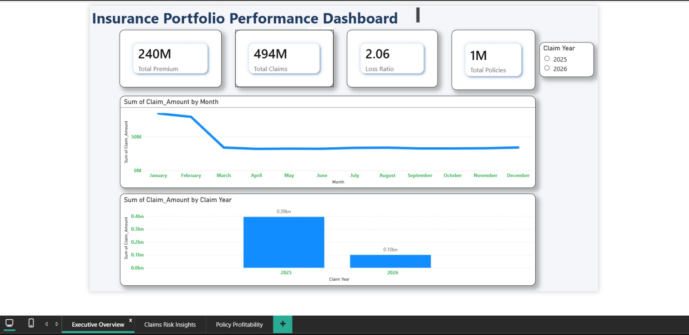
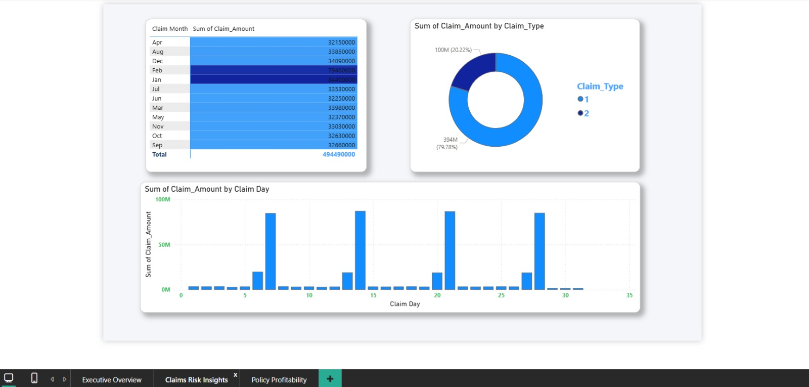
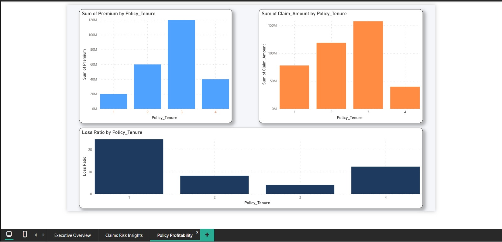

# Insurance Claims Analytics Project

A complete end-to-end insurance analytics project demonstrating **data simulation, SQL-based analysis, and business intelligence dashboarding using Power BI** to analyze claim patterns, financial risk, and portfolio profitability.

---

## Tools & Technologies

---

## Project Overview

This project simulates an insurance portfolio and analyzes claim behavior, risk exposure, and profitability trends. The goal was to generate realistic datasets, perform analytical queries to extract business insights, and build an interactive dashboard for visualization.

The project demonstrates the full **data analytics pipeline** including:

- Data simulation
- Data analysis
- Business intelligence visualization
- Insight generation

The analysis helps understand how claims impact the insurer's financial performance and highlights potential risk areas in the policy portfolio.

---

## Project Structure

---

## Data Simulation

Two datasets were generated to simulate a realistic insurance environment.

### Policy Sales Dataset

- Simulates **1,000,000 car insurance policies sold during 2024**
- Policy purchases distributed evenly across the year
- Policy tenure distribution:
  - 20% → 1 year
  - 30% → 2 years
  - 40% → 3 years
  - 10% → 4 years
- Vehicle value assumed to be **₹100,000**
- Premium calculated as **₹100 per year of policy tenure**
- Policy start and end dates derived from purchase date

### Claims Dataset

Claims were simulated based on business assumptions:

- In **2025**, 30% of vehicles purchased on the **7th, 14th, 21st, and 28th** of each month file claims.
- Claims occur on the **policy start date if the policy is active**.
- In **early 2026**, an additional **10% of vehicles with 4-year policies** file claims.
- Each claim amount equals **10% of the vehicle value**.

---

## Data Analysis (SQL)

SQL queries were written to analyze the datasets and answer key business questions:

- Total premium collected in 2024
- Monthly claim costs in 2025 and 2026
- Claim cost to premium ratio by policy tenure
- Claim cost to premium ratio by policy purchase month
- Estimation of future claim liabilities

These analyses help evaluate **portfolio profitability and financial risk exposure**.

---

## Dashboard (Power BI)

An interactive dashboard was developed using **Power BI** to visualize insights from the analysis.

The dashboard includes:

- KPI cards for **Total Premium and Total Claims**
- Monthly claims trend visualization
- Claims distribution by **policy tenure**
- Claims distribution by **purchase month**
- Risk and profitability indicators

The dashboard helps identify **claim spikes, high-risk segments, and profitability patterns** within the insurance portfolio.

---

## Dashboard Preview

### Overview Dashboard

### Claims Analysis

### Risk & Profitability Analysis

---

## Key Metrics Tracked

- Total Premium Collected
- Total Claims Paid
- Claim to Premium Ratio
- Claims by Policy Tenure
- Claims by Policy Purchase Month
- Monthly Claim Trends

---

## Key Insights

- Certain purchase dates show higher claim frequencies due to simulated defect patterns.
- Longer tenure policies increase long-term risk exposure.
- Claim spikes highlight periods where insurers may face higher financial liabilities.
- Monitoring claim distribution helps insurers adjust pricing and risk management strategies.

---

## Project Workflow

1. Data simulation using Python
2. Dataset generation in CSV format
3. Analytical queries using SQL
4. Data visualization using Power BI
5. Insight generation and reporting

---

## Large Files

Due to file size limitations on GitHub, some project files are hosted externally.

Power BI Dashboard (.pbix):  
(https://drive.google.com/file/d/1StAI3wT5aYgBKoOEb7a78eiRZWgU3moC/view?usp=sharing)

Policy Sales Dataset:  
(https://drive.google.com/file/d/1NmeaRV5Oujr0_6zfm6NiKUolMTKvlZ3n/view?usp=sharing)

Claims Dataset 2025:  
(https://drive.google.com/file/d/1x21vmWODOTT_9dONE4IHKDR3R70wTD7v/view?usp=sharing)

Claims Dataset 2026:  
(https://drive.google.com/file/d/1DDCN5q7rtuVi-7YKZ5GFTygxuc3YnVO9/view?usp=sharing)

---

## Conclusion

This project demonstrates the complete workflow of a **data analytics project**, from generating simulated business data to analyzing it and presenting insights through an interactive dashboard.

Such analysis helps organizations better understand risk patterns, evaluate profitability, and make data-driven decisions.

---

## Author

Krishna Singh  
Aspiring Data Analyst / Business Intelligence Enthusiast
